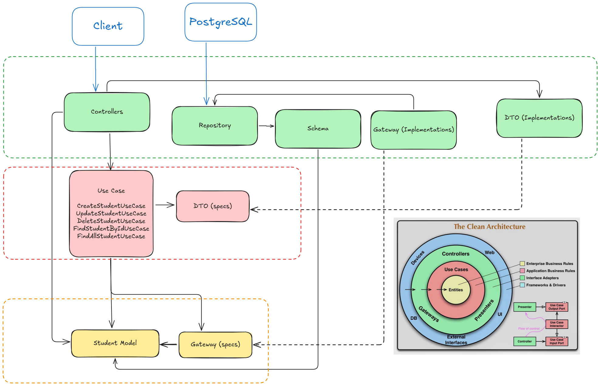

# Student CRUD Application

A RESTful API for managing student records, built with Spring Boot and Clean Architecture principles.

## Table of Contents
- [Technology Stack](#technology-stack)
- [Architecture](#architecture)
- [Features](#features)
- [Getting Started](#getting-started)
- [API Documentation](#api-documentation)
- [Deployment](#deployment)
- [References](#references)

## Technology Stack
- Java 21
- Spring Boot 3.4.2
- PostgreSQL
- Maven
- Docker (optional)

## Architecture
This project implements Clean Architecture with three main layers:



### 1. Entity Layer (Core)
Contains business logic and domain models:
- Student model
- Gateway interfaces


### 2. Use Case Layer
Implements application-specific business rules:
- CreateStudentUseCase
- UpdateStudentUseCase
- DeleteStudentUseCase
- FindStudentByIdUseCase
- FindAllStudentUseCase


### 3. Infrastructure Layer
Contains frameworks and external interfaces:
- Controllers
- Repository implementations
- Database schemas
- DTOs

## Features
- Create new student records
- Update existing student information
- Delete student records
- Retrieve student by ID
- List all students with pagination
- Input validation
- Error handling
- Clean Architecture implementation

## Getting Started

### Prerequisites
- JDK 21
- Maven
- PostgreSQL database

### Installation

1. Clone the repository:

```bash
git clone https://github.com/rhafaelc/xtramile-student-backend.git
cd xtramile-student-backend
```

2. Configure environment variables:

```bash
cp .env.example .env
```

3. Build Docker image:
```bash
docker build -t xtramile-student-backend .
```

4. Run Docker container:
```bash
docker run -p 8080:8080 --env-file .env xtramile-student-backend
```

The application will be available at `http://localhost:8080`

## API Documentation

[Postman API Documentation](https://documenter.getpostman.com/view/39388595/2sAYQfEVUX)


## Deployment
Was deployed on Digital Ocean.

Link: [https://oyster-app-fedek.ondigitalocean.app](https://oyster-app-fedek.ondigitalocean.app)

Database: Supabase


## References
- [Clean Architecture](https://blog.cleancoder.com/uncle-bob/2012/08/13/the-clean-architecture.html)
- [Spring Boot](https://spring.io/projects/spring-boot)
- [Spring Boot Clean Architecture](https://github.com/vinimrs/spring-boot-clean-architecture/)
- [PostgreSQL](https://www.postgresql.org/)
- [Supabase](https://supabase.com/)
- [Docker](https://www.docker.com/)
- [Postman](https://www.postman.com/)
- [Digital Ocean](https://www.digitalocean.com/)